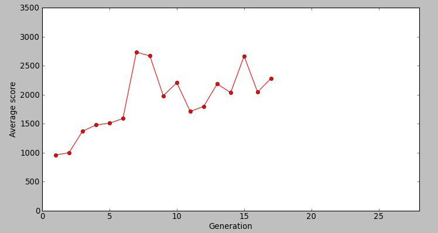
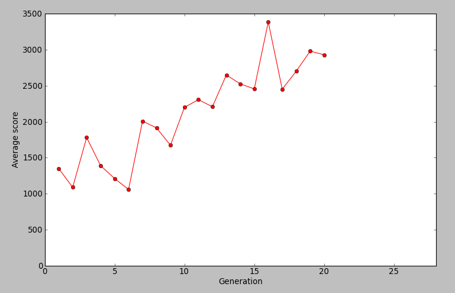

Project overview
================

A reinforcement learning algorithm for the 2048 game using decision trees and a
genetic algorithm.

The AI doesn't know the consequences of it's actions, it only see the game
state and it's score. No heuristic is used : the goal is to see if it is
possible for an AI to learn how to solve the game by itself.

Algorithm
=========

First version
-------------

The DNA contains k decision trees.
* A mutation consists in replace one of the trees by an other random one.
* A crossover consists in picking k random trees from each parent to build a new DNA

Each decision tree has a fixed height. Each node compares a random feature
with a random value choosed in the value-range of the selected feature.
Leafs contains either a decision either an "unknown decision".

The decision taken by an individual is choosed by a majority vote of each decision tree.
Of course, unknown decisions are not considered in the vote.

My vision of this design is that each tree "can be seen as a detector" of some
specific configurations of the board that should lead to a specific action.

Potential improvements
----------------------

It could be a good idea to process a meta-optimisation of these parameters :

* Population size
* Decision trees height
* Mutation rate
* Ratio of decision/unknown decision in the leafs of decision trees

At the moment, the only extracted features is an log histogram of the board. It
could be a good idea to count the mergeable tiles for each direction, variance,
or other features.

Finally, may be try to design a "real" genetic programming algorithm :D

Results
=======

These results has been measured at the git rev 214d1a68b9b3053a3dc44ca446cf80974d071032

High scores
-----------

At the moment, it is able to learn but it has not solved the game yet !
Best score : 10620 (after 10min training, did a 1024 tile)

Training overview
----------------

Other interesting trainig sessions :

